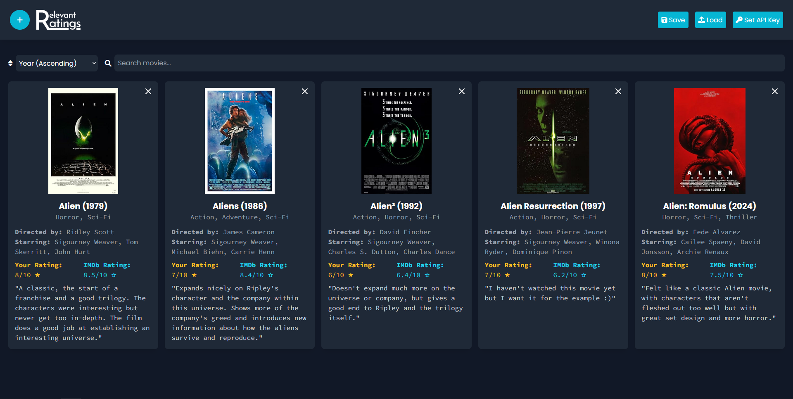

# Relevant Ratings
## Introduction

**Relevant Ratings** is a personal movie rating web app built with Vue.js, allowing you to search for movies, add personal ratings, and save reviews. The site uses the OMDb (Open Movie Database) API to fetch movie details like titles, genres, directors, and IMDb ratings.

I began this project after watching movies with my friends and discussing that we wanted something we could use to log all the things we had watched. We often rate them and give our thoughts, so I also implemented rating and review capabilities. Now we can view the movies we've watched before while also seeing how we thought about them! It also has the ability to save and load a JSON file with all the information that's stored in local storage, just in case you wanna share it with your friends!

## How It Works
1. **Set Your OMDb API Key**: Use the "Set API Key" button to configure your OMDb API key, which is saved in local storage for convenience. The API key is **entirely free** and has a daily limit of 1,000 calls. It only requires an email to receive the key.
2. **Search for Movies**: Start typing a movie name in the search bar and select from the list of suggestions. 
3. **Add a Movie**: Give your personal rating and review, and then add the movie to your list.
4. **Manage Your List**: Use the save/load buttons to download or upload your movie list as a JSON file. .

## Tech Stack
- **Vue.js**: For building a quick and reactive front-end!
- **Tailwind CSS**: For a simple yet sleek design.
- **OMDb API**: Used to fetch movie details. Completely free and I didn't need an account so I went with this!
- **Your browser's Local Storage**: Saves user preferences, reviews, and movie lists.